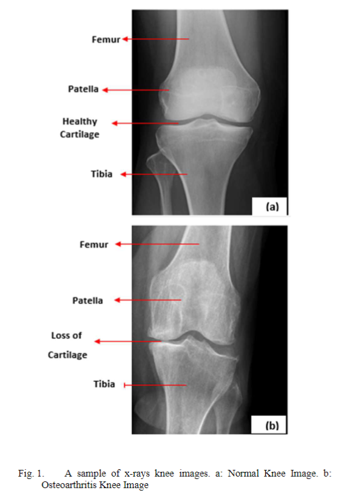
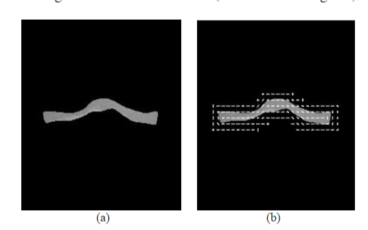

- Ở đây là những ý tưởng để mình xử lý preprocessing data

# Histogram

Ta có nhận xét: 
- Với ảnh dark thì histogram có các cột tập trung vào bên trái tương ứng với màu tối
- Với ảnh light thì histogram có tập trung vào bên phải chứa các pixel trắng
- Với ảnh độ tương phản thấp (low-contrast) thì histogram có các cột tập trung xít nhau  và ở giữa
- Với ảnh độ tương phản cao (high-contrast) thì histogram san đều với các giá trị
# Phóng to ảnh 
- 

# CLAHE

# Data augmentation
- diffusion model

# Method
- 
- 
# Summary
Image preprocessing is a crucial step in the analysis and understanding of X-ray images, particularly in the context of diagnosing knee osteoarthritis (OA). It enhances significant data characteristics and prepares the database for data analysis. The primary goals of image preprocessing are to **improve image quality, remove noise and artifacts, enhance contrast, and standardize the images** to improve the accuracy and reliability of subsequent analysis.

Here's a breakdown of common image preprocessing techniques used for knee OA diagnosis with X-rays, as discussed in the sources:

- **Resizing**: Knee X-ray images are often resized to a standard dimension to ensure uniformity across the dataset. For example, one study mentions resizing images to 320x224 pixels. Another study resizes images to 224x224.
- **Noise Reduction**: Reducing noise in X-ray images is a common preprocessing step to improve image quality.
- **Contrast Enhancement**:
    - **Histogram Equalization**: **Histogram equalization** is employed to improve contrast by increasing the dispersion of the highest frequency and decreasing that of other frequencies.
    - **Contrast Limited Adaptive Histogram Equalization (CLAHE)**: CLAHE enhances contrast in images while limiting the amplification of noise. It improves local contrast and edge definition. In one study, CLAHE with a block size of 8x8 pixels and a clip limit of 0.03 was used for preprocessing.
- **Frequency Domain Filtering**:
    - **Circular Fourier Filtering (CFF)**: Filtering in the Fourier domain can help remove information related to the acquisition process and retain essential information related to the trabecular bone structure. This aims to stationarize the data. For example, one study removed the first 60 rays of the Fourier spectrum.
    - **High-Pass Filtering**: High-pass filters can be applied to make the trabecular bone texture more obvious.
- **Intensity Normalization**: Intensity normalization using multivariate linear regression (MLR) can reduce inter-subject variability and artifacts in regions of interest (ROIs). This ensures comparability within and across images of different subjects.
- **Data Rebalancing**: To address the unbalanced distribution of data among different KL grades, a rebalance operation can be performed. This may involve techniques such as flipping images or random sampling to ensure each grade is adequately represented in the dataset.
- **Data Augmentation**: Data augmentation techniques, like shifting, rotating, and flipping, can be applied to expand the dataset and improve the training model.

The specific preprocessing steps applied can significantly impact the performance of subsequent analysis and classification tasks.

# Note
- Hiện tại thì vs ảnh lúc đầu quá sáng thì CLAHE vẫn chưa cân bằng đc 
- Mình cững chưa hiểu cách cân bằng của 2 giải thuật 
- Mình chưa xác định được là nó đã oke chưa và chưa thử train nó như thế nào. Cái này mình họp rồi thảo luận. 
- Hiện tại mình có 1 số pdf của về explainable AI XAI để đọc mà mình chưa đọc về nó 
# Keyword
- **Femur (Xương đùi)** – Đây là xương lớn nhất của cơ thể, nằm phía trên trong khớp gối. Nó kết nối với xương chày (tibia) để tạo thành khớp gối.
    
- **Patella (Xương bánh chè)** – Xương nhỏ hình tam giác nằm ở phía trước khớp gối, giúp bảo vệ khớp và hỗ trợ chuyển động.
    
- **Healthy Cartilage (Sụn khỏe mạnh)** – Lớp sụn bao phủ đầu xương giúp giảm ma sát giữa các bề mặt xương trong khớp gối. Nếu sụn bị tổn thương, có thể dẫn đến viêm khớp hoặc thoái hóa khớp.
    
- **Tibia (Xương chày)** – Xương lớn của cẳng chân, nằm phía dưới trong khớp gối và là một trong hai xương chính của cẳng chân, giúp hỗ trợ trọng lượng cơ thể.

# Link
- Ở đây là các link có thể tìm đọc để hiểu thêm về histogram.
https://www.50mm.vn/2016/06/01/hau-ky-can-ban-cach-doc-histogram/
https://stackoverflow.com/questions/67624759/how-to-segment-femur-from-x-ray-in-opencv

## Paper
- https://arxiv.org/pdf/2309.09328
- **[1]** P. N. Chowdary, G. V. N. S. L. Vardhan, M. S. Akshay, M. S. Aashish, V. S. Aravind, G. V. K. Rayalu, and A. P., _Enhancing Knee Osteoarthritis Severity Level Classification Using Diffusion Augmented Images_, arXiv preprint, arXiv:2309.09328 (2023). Truy cập: [https://arxiv.org/pdf/2309.09328](https://arxiv.org/pdf/2309.09328).
- Determination of Osteoarthritis Using Histogram of Oriented Gradients and Multiclass SVM
- Estimating the severity of knee osteoarthritis using Deep Convolutional Neural Network based on Contrast Limited Adaptive Histogram Equalization technique
- 