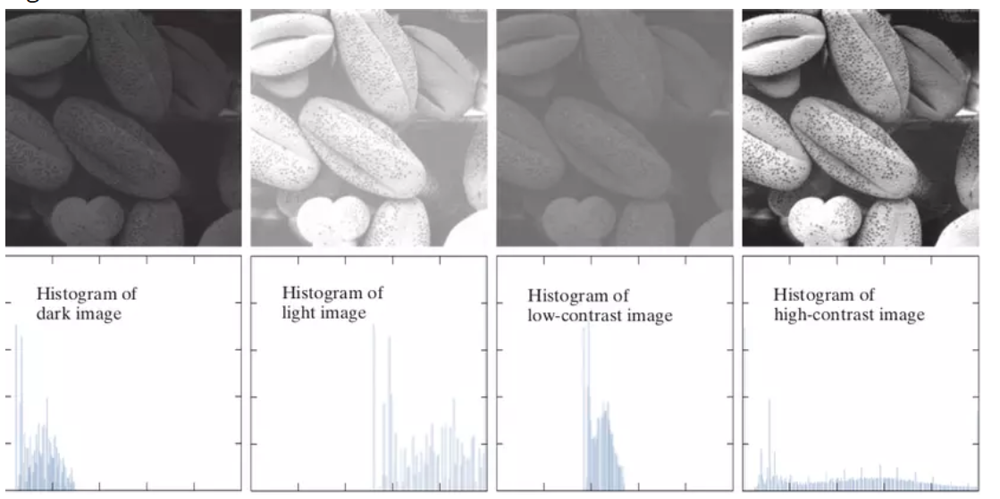
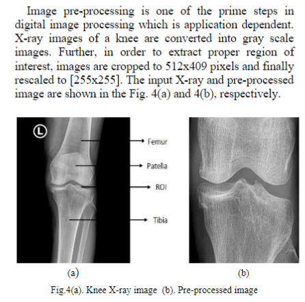
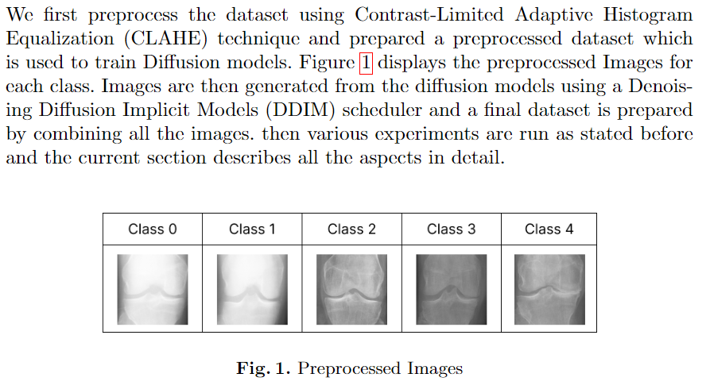
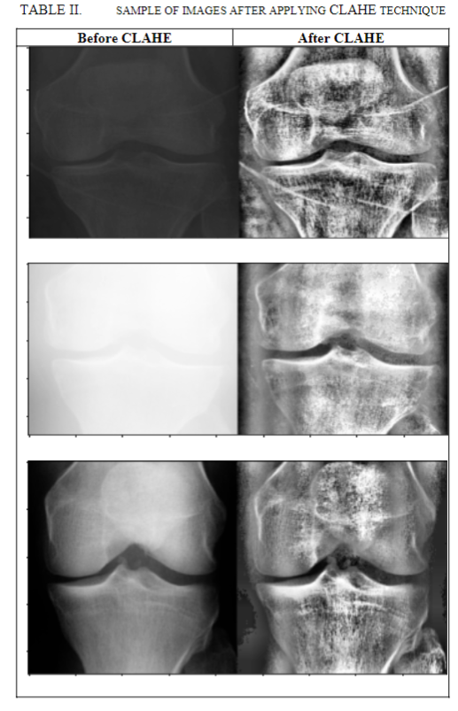
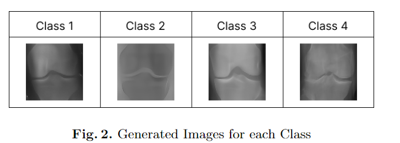
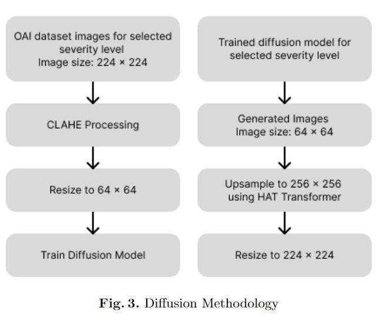

- Ở đây là những ý tưởng để mình xử lý preprocessing data

# Histogram

Ta có nhận xét: 

- Với ảnh dark thì histogram có các cột tập trung vào bên trái tương ứng với màu tối
- Với ảnh light thì histogram có tập trung vào bên phải chứa các pixel trắng
- Với ảnh độ tương phản thấp (low-contrast) thì histogram có các cột tập trung xít nhau  và ở giữa
- Với ảnh độ tương phản cao (high-contrast) thì histogram san đều với các giá trị
# Phóng to ảnh 

# CLAHE

# Data augmentation
- diffusion model

# Note
- Hiện tại thì vs ảnh lúc đầu quá sáng thì CLAHE vẫn chưa cân bằng đc 
- Mình cững chưa hiểu cách cân bằng của 2 giải thuật 
- Mình chưa xác định được là nó đã oke chưa và chưa thử train nó như thế nào. Cái này mình họp rồi thảo luận. 

# Link
- Ở đây là các link có thể tìm đọc để hiểu thêm về histogram.
https://www.50mm.vn/2016/06/01/hau-ky-can-ban-cach-doc-histogram/

