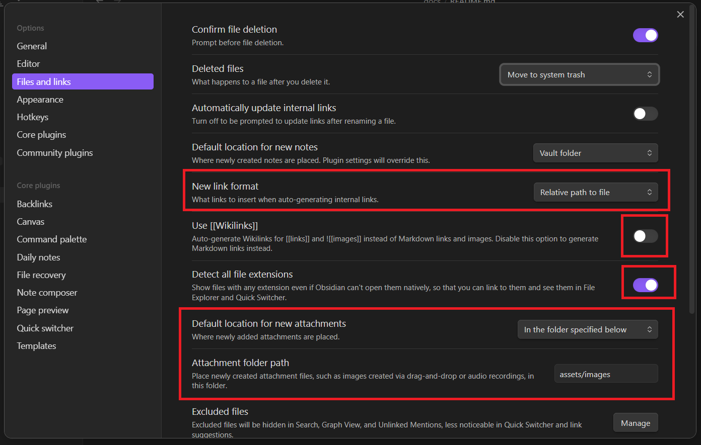
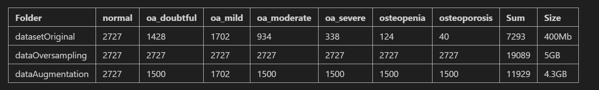

# I. Set up obsidian

- Đây là cách set up obsidian để thiết lập 1 dự án để, nó sẽ giúp readme.md dễ dàng ghi chú. 

# II. Generate data
- Mình đã có vấn đề khi generate data với 2 phương pháp là **Oversampling** và **Augumentaion**. Nhưng khi mình set tỉ lệ có 1 chút vấn đề và dung lượng sinh ra rất lớn. Nên giờ mình sẽ làm là có 1 file jupyter khảo sát về data. 

# III. Push data
- Mình có 1 jupyter, về push data lên hugging để sử dụng nhưng mà chư ổn lắm. Chắc mình sẽ sửa và up lại sau

# IV. Preprocessing data
- Ở đây mình sẽ tìm hiểu data 
- Xử lý imbalance data, và preprocessing data: Histogram, brightly..
